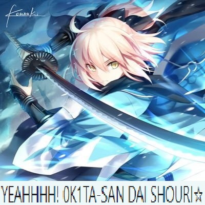

# [MISC - Stegano]
## Watasi Wa...?
Do you know which universe this historical figure belongs to?
### Solution:
We are presented with the image **Anime.jpg**. After inspecting the image in its hex representation and reading about .jpg file format we will see there is more in the file. So first thing let's cut out the first image until it's ending tag `FF D9`.  This is a 72123 bytes 400x350 image. One of the many tests to find interesting stegano stuff is to see if there are hidden pixels. To be quick we can use https://fotoforensics.com/ and in fact there are some. Let's change the image size in 400x400 so after the `FF C0` marker we change `01 5E 01 90` into `01 90 01 90`. By opening the image we get

