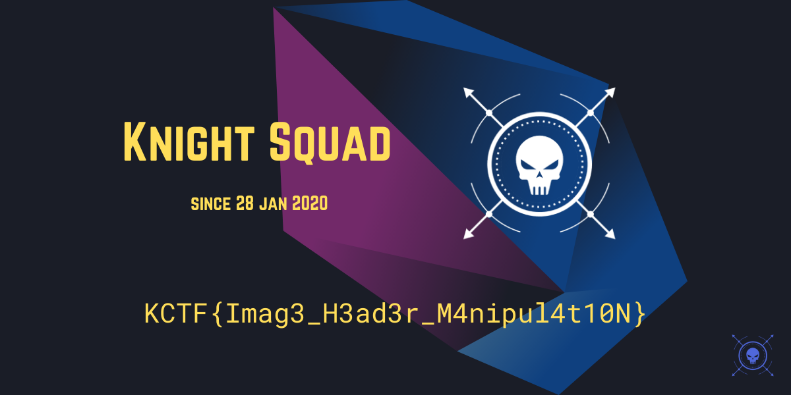

## Digital Forensics  
  
### The Lost Flag  
We recovered a image file from an incident. There might be something interesting in the file. Give it a try.  
  
Flag Format: KCTF{pla1n_t3xt_here}  
Author : TareqAhamed  
  
This is a visual stego. Information is hidden in the LSB 2 bits of the RGB values. Using **stegsolve** or **steganabara** (_tools to recognise this type of stego quite quickly_) we get the solution.
    
  
---  
  
### Compromised FTP  
We detected some malicious activity on our FTP server. Someone has performed bruteforce attack to gain access to our FTP server. Find out the Compromised FTP account username & the attacker IP from the following.  
[Download Link](./files/ftp.log)  
Flag Format: KCTF{username_127.0.0.1}  
Author : TareqAhamed  
Unknown File (50)  
  
Viewing the content of the log we see tousands of tries. By playing a bit with **grep** we eventually construct following command:  
```
$ cat ftp.log | grep -v "FAIL LOGIN" | grep -v -n -B 2 -A 2 "CONNECT" 
1118-Mon Jan  3 15:24:13 2022 [pid 5414] CONNECT: Client "::ffff:192.168.1.7"
1119-Mon Jan  3 15:24:13 2022 [pid 5416] CONNECT: Client "::ffff:192.168.1.7"
1120:Mon Jan  3 15:24:13 2022 [pid 5399] [ftpuser] OK LOGIN: Client "::ffff:192.168.1.7"
1121-Mon Jan  3 15:24:13 2022 [pid 5419] CONNECT: Client "::ffff:192.168.1.7"
1122-Mon Jan  3 15:24:15 2022 [pid 5421] CONNECT: Client "::ffff:192.168.1.7"
```
... or simply `$ cat ftp.log | grep "OK LOGIN"`.  

---  
  
### Unknown File  
My friend sent me a file & told me there is a flag in it. He dare me to find the flag. But I have no idea what the file is about. Can you help me get the flag?  
[Download Link](./files/unknown%20file.zip)  
Flag Format: KCTF{pla1n_t3xt_here}  
Author : TareqAhamed  
Let's Walk Together (50)  
  
We first **unzip** it. **file** simply tells it's data. Looking at the first hex-lines we discover it is a corrupted image png file. So we modify the first 4 bytes into the correct signature and rename it.  
```
$ unzip unknown\ file.zip 
Archive:  unknown file.zip
  inflating: unknown file    

$ file unknown\ file
unknown file: data

$ xxd unknown\ file | head -2
00000000: 0010 5665 0d0a 1a0a 0000 000d 4948 4452  ..Ve........IHDR
00000010: 0000 04b0 0000 0258 0806 0000 0072 e61f  .......X.....r..
```
```
$ xxd unknown.png | head -2
00000000: 8950 4e47 0d0a 1a0a 0000 000d 4948 4452  .PNG........IHDR
00000010: 0000 04b0 0000 0258 0806 0000 0072 e61f  .......X.....r..
```
  

---  
  
### Let's walk together  
Do you know anything about this image?  
  
Flag Format: KCTF{S0m3_Tex7_H3re}  
Author: TareqAhmed  
  
The title is a reference to the **binwalk** tool. Let's try it out:
```
$ binwalk -e interesting_waves.png 

DECIMAL       HEXADECIMAL     DESCRIPTION
--------------------------------------------------------------------------------
0             0x0             PNG image, 1024 x 768, 8-bit/color RGBA, non-interlaced
99            0x63            Zlib compressed data, best compression
69968         0x11150         Zip archive data, at least v1.0 to extract, name: Flag/
70031         0x1118F         Zip archive data, encrypted at least v1.0 to extract, compressed size: 37, uncompressed size: 25, name: Flag/flag.txt
70313         0x112A9         End of Zip archive, footer length: 22
```
  
The extracted zip file is password protected. Let's try to find it out and directly pipe the contents (_since it's a simple textfile_):
```
$ fcrackzip -D -p /usr/share/wordlists/rockyou.txt -u 11150.zip 
PASSWORD FOUND!!!!: pw == letmein!

$ unzip -p 11150.zip 
[11150.zip] Flag/flag.txt password: 
KCTF{BiNw4lk_is_h3lpfUl}
```
