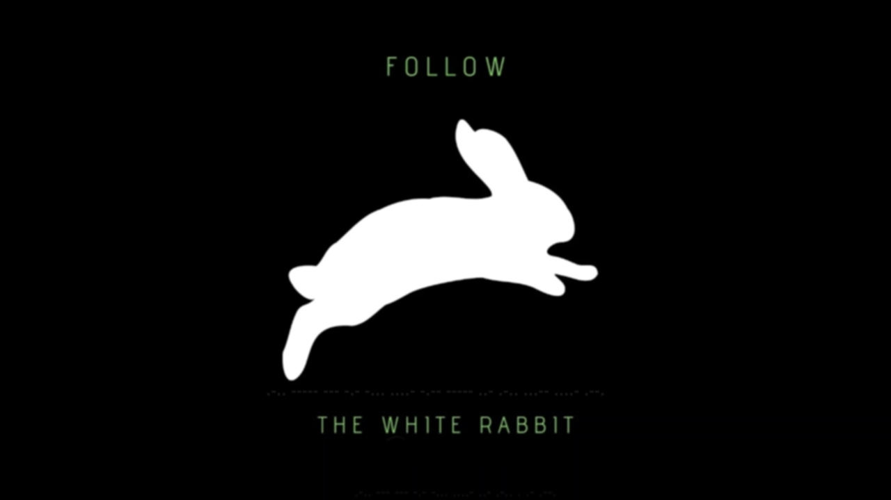
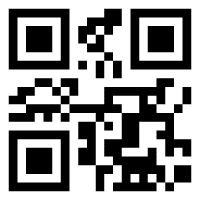

# STEGANO

## FileD (25)
Can you see everything?  
[Download Link](./files/filed.kra)  
Flag Format: KCTF{S0m3_text_h3r3}  
Author: 1xR1fat

A little searching in the web we will learn that this is a **Krita** (_pixel-based image manipulation program_) file. After installation we open the file and will discover it has many layers... a little bit like Gimp. After viewing each layer, we see the 3rd layer named ctf.png contains the flag `KCTF{W00_n1ce_you_got_me}`.

---

## Follow The White Rabbit (25)
Will you choose to follow the white rabbit like NEO? THINK wisely or LOOK your path deeply before you take step.  
  
Flag Format: KCTF{S0M3TEXTH3R3}  
Author: marufmurtuza  

A very good stego tool is Caesum's Stegsolve or quangntenemy's steganabara. Mainly because they let you very quickly go through the different bit-planes of the image. We will discover, that some Morse code is involved in the bit-planes 0, 1, 2, 3 and 4. To hurry, we use [DCode.fr](https://www.dcode.fr/morse-code) in order to retrive the flag. At the moment I don't exactly remember which was the working one, but one of these:
- `KCTF{LOOKB4ULEAP}`
- `KCTF{L0OKB4Y0UL34P}`

---

## Follow (25)
Follow the rules ?  
[Download Links](./files/Follow.pdf)  
Author: 1xR1fat  

If it's only 25 worth, then it should be easy. After opening the pdf in a viewer and trying to select everything, we discover there is a part of text with the same color as the background. `KCTF{This_is_the_real_flag}`

---

## QR Code From The Future - (100)
The following file was found in a device from a crashed UFO. Can you solve that mystery?  
  
Flag Example: KCTF{SOME_text_here}  
Author : marufmurtuza  

Scanning one of the frames gives an ASCII char. So I thought that each frame represents one single char. It would take too long. So after reading some tutorials online, I managed to write following script in order to iterate each frame, decode the qrcode and in the end, through http://theblob.org/rot.cgi decrypt the ROT-13 ciphertext which results in the flag:
- KCTF{QR_CODE_GOT_EVOLVED_FROM_STATIC_TO_DYNAMIC}
- KCTF{QR_code_got_evolved_from_static_to_dynamic}  
```python
import os
from PIL import Image
from pyzbar.pyzbar import decode

im = Image.open('QR_Code_From_The_Future.gif')
framenr = 0
try:
    while True:
        im.seek(framenr)
        im.save(f'QRCodes/frame{framenr}.png')
        framenr += 1
except EOFError:
    pass

scanned = b''
for filename in os.scandir('QRCodes'):
    scanned += decode(Image.open(filename.path))[0].data

print(scanned[::-1])
```

---

## Bangladesh (100)
My friend John was interested to know my country . He told me that to give him some images and articles about my county . I gave him some images and articles. In one image I provided some hidden data but he can not find hidden data . I told him Always remember 3 number sum equal to a game-changer. but he can not find hidden data . For that reason, I gave him that game-changer key.


With this one I struggled quite a while trying to understand the pseudo-hints in the description and the 330 in bottom left corner. By reading so many tutorials in the web, we see that **steghide** is very commonly used to hide data in jpg files. So I tried **stegseek** which fortunately found out the password and extracted the data.
```
$ stegseek --crack Bangladesh.jpg 
StegSeek 0.6 - https://github.com/RickdeJager/StegSeek

[i] Found passphrase: "2262"B)           
[i] Original filename: "not_real".
[i] Extracting to "Bangladesh.jpg.out".

$ cat Bangladesh.jpg.out 
KCTF{Do_We_Remember_Cicada_3301}
```
